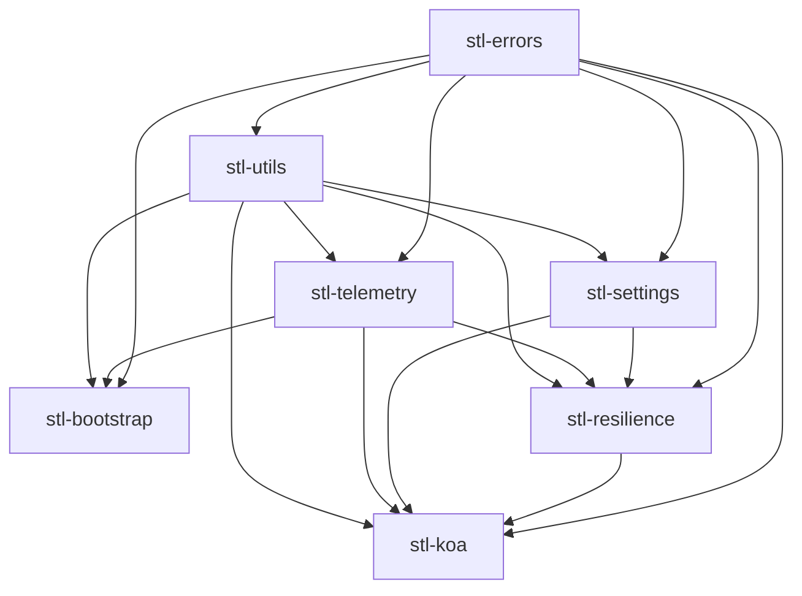

# TypeScript development toolkit 

## NPM Packages

* Tools
  * [`inlinable`](/packages/tools/inlinable)

* Libraries
  * [`@mtth/stl-bootstrap`](/packages/libs/stl-bootstrap)
  * [`@mtth/stl-errors`](/packages/libs/stl-errors)
  * [`@mtth/stl-resilience`](/packages/libs/stl-resilience)
  * [`@mtth/stl-settings`](/packages/libs/stl-settings)
  * [`@mtth/stl-telemetry`](/packages/libs/stl-telemetry)
  * [`@mtth/stl-utils`](/packages/libs/stl-utils)

* Configurations
  * [`@mtth/eslint-plugin`](/packages/configs/eslint-plugin)
  * [`@mtth/prettier-typescript`](/packages/configs/prettier-typescript)
  * [`@mtth/tsconfig`](/packages/configs/tsconfig)

## Libraries dependency flow

